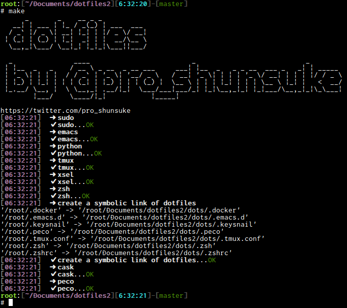

# Dotfiles

This is my dotfiles repository.



## Installation

```sh
% git clone git@github.com:proshunsuke/dotfiles2.git 
% cd dotfiles2
% make
```

## Platform

* Linux
  * Debian
  * Arch

## Try

Let's try in docker container.

### Debian

```sh
% make up-debian
% make install-in-debian
% make ssh-debian-zsh
```
